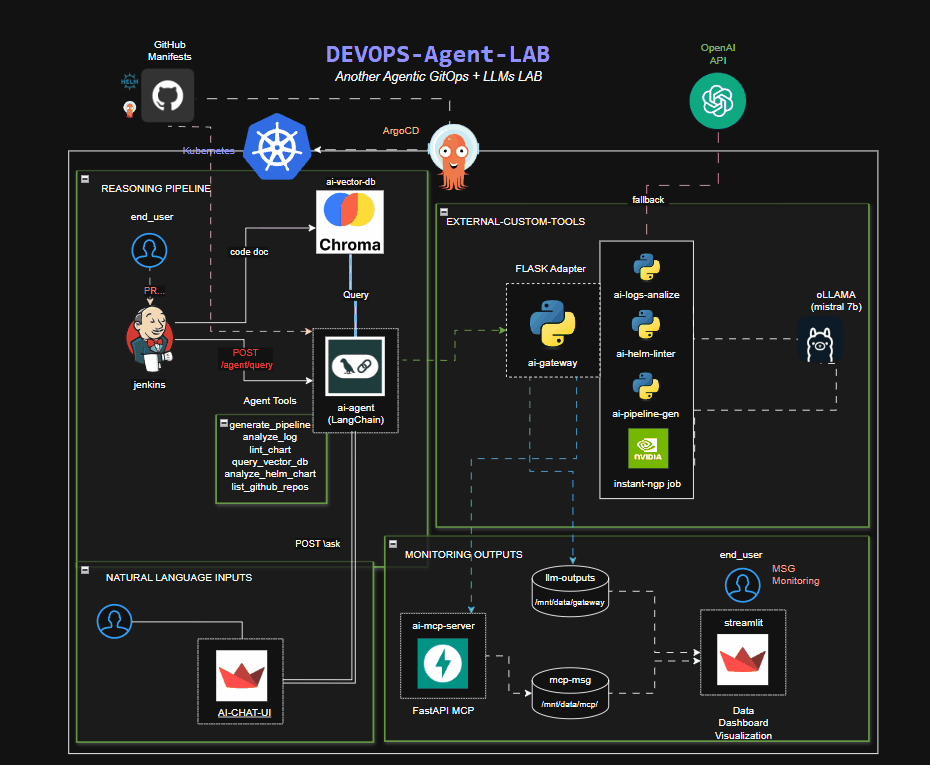

# 🧪 devops-ai-lab

**AI-integrated DevOps Lab – 100% Local & Modular**  
**Laboratorio DevOps con IA – Modular y totalmente local**

> _See detailed docs in [English](./README_ENG.md) or [Español](./README_ES.md)._  
> _Consulta la documentación detallada en [Español](./README_ES.md) o [English](./README_ENG.md)._

---

Entorno DevOps real (Jenkins + Kubernetes + IA) para integraciones locales con agentes inteligentes:
- Análisis automático de logs de Jenkins
- Linting semántico de Helm Charts comprimidos (.tgz)
- Generación de pipelines desde texto libre
- Registro vectorial del contexto del desarrollo (código, cambios, errores)
- Despliegue modular con Helm y ArgoCD (GitOps)
- Agente LangChain conectado a Ollama local (con fallback a OpenAI)

---

Full local DevOps environment (Jenkins + Kubernetes + AI) powered by intelligent agents:
- Auto log analysis (Jenkins)
- Semantic linting of compressed Helm Charts (.tgz)
- Natural language pipeline generation
- Vector database for development context (code, changelog, logs)
- Modular deployment with Helm + ArgoCD (GitOps)
- LangChain agent connected to local Ollama with OpenAI fallback

---

🧠 **Modular • 100% local • AI-augmented DevOps**  
🧠 **Modular • Totalmente local • DevOps aumentado con IA**

---

## ⚙️ Core Tools

- 🧱 `generate-pipeline`: genera un Jenkinsfile desde una descripción en lenguaje natural.
- 🔍 `analyze-log`: analiza logs de Jenkins y detecta errores comunes.
- 🧪 `lint-chart`: valida Charts Helm `.tgz` y explica su estructura y problemas.
- 🧠 `ask-agent`: permite consultas tipo RAG (Retrieval-Augmented Generation) sobre el contexto técnico (repos, logs, código, etc.).
- 📦 `list-repos`: lista repositorios y su contenido desde GitHub.

---

## 🔄 Ejemplo de Flujo Real

1. Un desarrollador hace **push** con nuevos cambios a GitHub.
2. Jenkins ejecuta el pipeline generado por IA y compila la aplicación.
3. La build inyecta el changelog, logs, y metadata contextual en una **base vectorial**.
4. Si la build **falla**, los logs y el historial son enviados al **Agente LangChain**.
5. El agente utiliza herramientas internas (analyze-log, lint-chart, etc.) para diagnosticar el error.
6. Toda la actividad (consultas, respuestas, recomendaciones) queda registrada y disponible para revisión en un **dashboard de seguimiento**.

---

## 📚 Docs / Documentación

- 🇪🇸 [README en Español](./README_ES.md): guía completa de arquitectura, servicios y despliegue.
- 🇬🇧 [README in English](./README_ENG.md): full guide to architecture, included services, and local setup.

---

**Maintained by / Mantenido por**  
[@dorado-ai-devops](https://github.com/dorado-ai-devops)  
[LinkedIn – Daniel Dorado](https://www.linkedin.com/in/doradodaniel/)
